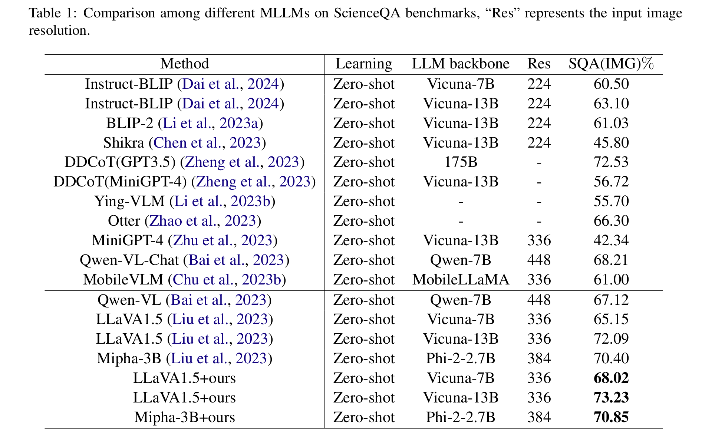

<h1 align="center">Simignore:Enhancing Multimodal Large Language Models Complex Reason via Similarity Computation</h1>


<div align=center>
<br>
</div>


## Setup
```bash
conda create -n simignore python=3.10
conda activate simignore
cd src
bash setup.sh
```

## Checkpoint

You can download **LLaVA1.5-7b** from [Hugging Face](https://huggingface.co/liuhaotian/llava-v1.5-7b) and save it under `checkpoint/llava`.
## ScienceQA dataset
You can download **ScienceQA** from [Google Drive](https://drive.google.com/drive/folders/1w8imCXWYn2LxajmGeGH_g5DaL2rabHev?usp=sharing) and unzip the images under `data/scienceqa/images`.

## Simignore Zero-shot Inference
We provide the Zero-shot inference procedure for the LLaVA1.5-7b model and the LLaVA1.5-13b model on the *ScienceQA(Image)* dataset. We conduct the following experiments on one 4090D GPU (24G).

Inference using LLaVA-v1.5-7b model.
```bash
bash ./src/Simignore/inference/eval/eval_sqa_latency_inplace.sh
```
Inference using LLaVA-v1.5-13b model.
```bash
bash ./src/Simignore/inference/eval/eval_sqa_latency_inplace_13b.sh 
```


## Simignore Evaluatio

Evaluation using LLaVA-v1.5-7b model.
```bash
bash ./src/Simignore/inference/eval/generate_sqa_results.sh
```
Evaluation using LLaVA-v1.5-13b model.
```bash
bash ./src/Simignore/inference/eval/generate_sqa_results_13b.sh 
```
## Main result
<div align=center>
<br>
</div>
